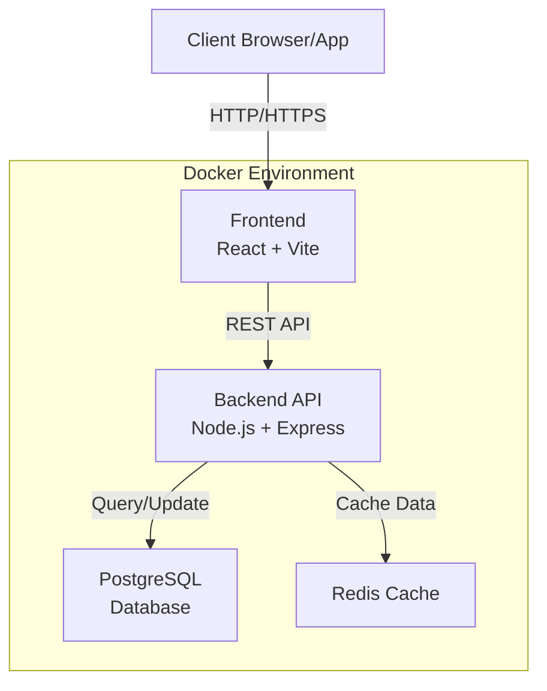
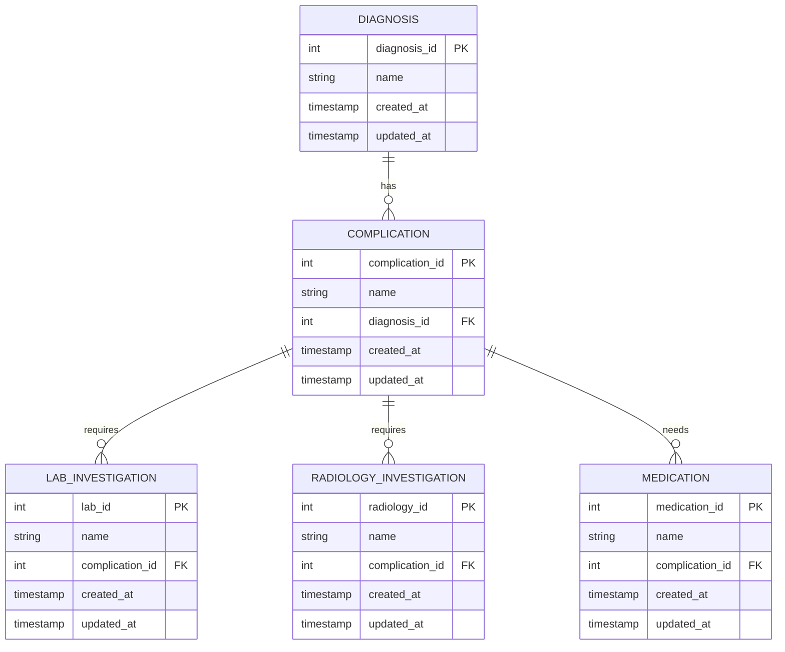
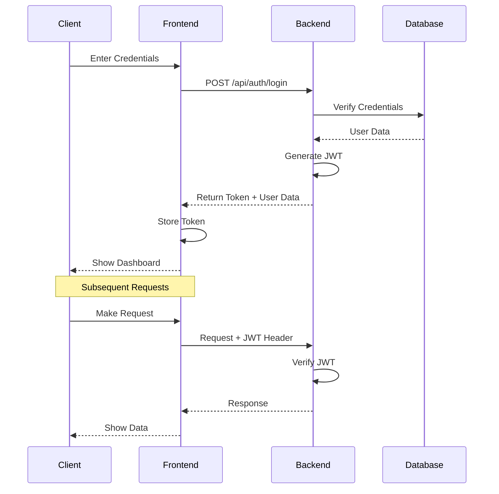
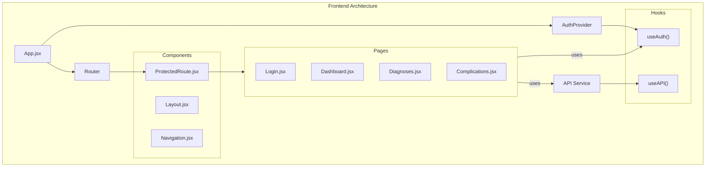
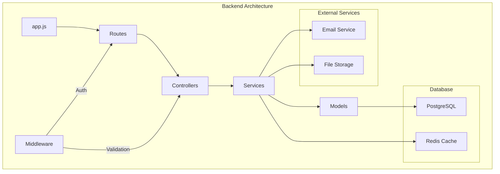

# System Architecture

This document provides a comprehensive overview of the NABH Platform's architecture through various diagrams.

## System Overview

The NABH Platform uses a modern microservices architecture with the following key components:
- React frontend with Vite
- Node.js backend with Express
- PostgreSQL database
- Redis cache
- Docker containerization

### High-Level Architecture

## Database Schema

The following Entity Relationship Diagram (ERD) shows the database structure:

## Authentication Flow

The sequence diagram below illustrates the authentication process:

## Frontend Architecture

The frontend follows a component-based architecture:

## Backend Architecture

The backend follows a layered architecture pattern:

## Key Components

### Frontend
- **React + Vite**: Modern frontend framework with fast build tools
- **TailwindCSS**: Utility-first CSS framework
- **React Query**: Data fetching and caching
- **React Router**: Client-side routing
- **Zustand**: State management

### Backend
- **Node.js + Express**: Server framework
- **PostgreSQL**: Primary database
- **Redis**: Caching layer
- **JWT**: Authentication
- **Express Validator**: Request validation

### DevOps
- **Docker**: Containerization
- **Docker Compose**: Multi-container orchestration
- **GitHub Actions**: CI/CD (planned)
- **Nginx**: Reverse proxy (production) 